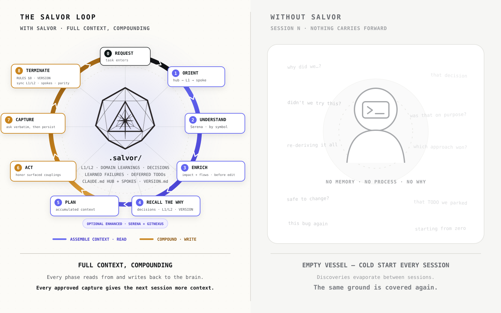

<div align="center">


# Salvor

### Give your codebase a memory — a version-controlled brain your whole team's AI shares.

[](https://github.com/dwasyluk/salvor/releases)
[](./LICENSE)
[](./docs/VENDOR_ADAPTERS.md)
[](./CONTRIBUTING.md)

*Salvage your project's knowledge before it's lost to the next session.*

</div>

---

## What is this?

Out of the box, an LLM coding CLI **forgets everything between sessions.** The
*why* behind a decision a teammate made two months ago — in another session, maybe
on another model — is gone. Re-derived. Re-litigated. Or quietly lost.

**Salvor is a disciplined structure you add to any repo** so that any AI agent —
any session, any contributor, even a different vendor — works against the same
accumulated, git-tracked knowledge. It is **prompt-first**: paste one prompt,
answer a few questions, and your project gains a hub-and-spoke context layer, a
two-tier persisted memory, a strict rules protocol, and three user-gated triggers
that capture knowledge *and the reasoning behind it* as you work. All in git, so
the whole team's agents share one compounding brain.

No SaaS. No lock-in. No account. Just files + two open-source MCP servers.

## Is this another AI second brain?

No. Salvor is the **codebase/team wedge** of the persistent-agent-memory trend:
code-grounded, git-shared, governed, and engineering-specific. It borrows the
good idea from LLM Wiki / GBrain-style systems: durable knowledge should
compound instead of evaporating. Salvor applies it to software teams, where the
canonical memory has to live in git and stay tied to code, commits, versions,
failures, and impact analysis.

| | Built for | Lives in | Code-aware? |
|---|---|---|---|
| **Salvor** | a **team's codebase** | **git, in your repo** | **yes** |
| Obsidian + Claude | personal notes | a local vault | no |
| GBrain | personal / company knowledge | a local database | no |

And it stays **local by default** — files in your repo plus two local MCP servers,
no SaaS and no calendar/email/vault scopes. For the full comparison — plus RAG,
`CLAUDE.md`, Cline Memory Bank, Cursor/Copilot, and vendor memory — see
**[`docs/FAQ.md`](./docs/FAQ.md)**.

## Prerequisites — two MCP servers (and why)

Salvor stands on two free, open-source [MCP](https://modelcontextprotocol.io)
servers. Install them once; they work across Claude Code, Codex, Gemini CLI, and
Cursor.

### 🧠 Serena — *semantic code intelligence*
Lets your agent navigate code **by symbol** (find definitions, callers, references)
and make targeted edits, instead of re-reading whole files into context. It's the
IDE-agnostic way to get Cursor-like understanding in any CLI.

- **Install (Claude Code):**
  ```bash
  claude mcp add serena -- uvx --from git+https://github.com/oraios/serena \
    serena start-mcp-server --context ide-assistant --project "$(pwd)"
  ```
  (Requires [`uv`](https://docs.astral.sh/uv/). Other CLIs: see the
  [Serena README](https://github.com/oraios/serena).)
- **Account / API key?** ❌ None. Fully local and free.

### 🕸️ GitNexus — *codebase knowledge graph*
Builds a graph of your code (symbols, relationships, execution flows) so the agent
can run **impact analysis before it edits** — "what breaks if I change this?" — and
stop shipping blind changes to code you have to assume is untested.

- **Install:**
  ```bash
  npm i -g gitnexus && gitnexus setup
  ```
- **Account / API key?** ❌ None for core indexing/querying. *(Only the optional
  `gitnexus wiki` doc generator wants an LLM API key.)*
- **Docs:** [github.com/abhigyanpatwari/GitNexus](https://github.com/abhigyanpatwari/GitNexus)

## Quickstart

```text
1. Install the two MCP servers above (Serena + GitNexus).
2. Open your LLM CLI in the project you want to give a memory to (new or existing).
3. Paste the contents of SETUP_PROMPT.md.
4. Answer a couple of questions: project name · components + stacks · (optional) paired-path parity.
5. The agent scaffolds Salvor, makes the initial commit, and runs `gitnexus analyze`.
6. Done — your repo now has a shared, version-controlled brain.
```

👉 The whole installer is one file: **[`SETUP_PROMPT.md`](./SETUP_PROMPT.md)**.

## Features

- **🎯 Hub-and-spoke context** — load only the component you're touching; pay for
  the context you use.
- **🧊 Two-tier memory** — L1 (≤50-line dense current state) + L2 (unbounded deep
  archive). Cheap to read, complete to recover.
- **🔔 Three user-gated capture triggers** — learnings & design decisions, failures,
  and deferred TODOs, each captured *with their reasoning*, only when you say so.
- **🧠 Serena** symbol intelligence + **🕸️ GitNexus** impact analysis, baked into
  the workflow.
- **🏷️ Per-component versioning** — `VERSION.md` as single source of truth, every
  bump carrying its *why*.
- **🔌 Multivendor out of the box** — `CLAUDE.md` + `AGENTS.md` + `GEMINI.md` entrypoints
  generated by default; the core is vendor-neutral, no lock-in, no vendor to pick.

## The core idea: three capture triggers

Salvor's defining move — the agent **notices** knowledge worth keeping and **asks
you, verbatim, before saving it.** Never silent (so capture can't fail unnoticed),
never automatic (so your docs don't bloat without your say):

| Trigger | Captures | The agent asks… | Lands in |
|---|---|---|---|
| **Continued Learning** | a discovery, decision, or **design invariant** + its *why* | `"…domain learning?"` (finding) · `"Record this as a design decision?"` (decision) | `.salvor/domain-learnings/` or `.salvor/decisions/` + `DOMAIN_REF.md` + L1/L2 |
| **Learned Failure (LF#)** | a recurring failure mode + root cause | *(via the same flow)* | `DOMAIN_REF.md` LF# registry |
| **Deferred TODO** | an out-of-scope finding, parked not dropped | `"Log this to .salvor/DEFERRED_TODOS.md? (yes/no)"` | `.salvor/DEFERRED_TODOS.md` |

"What we learned," "how we failed," and "what we noticed but parked" are different
kinds of knowledge — Salvor gives each its own home.

## How it works

Five pillars: hub-and-spoke context · two-tier persisted memory · a `RULES.md`
enforcement protocol · a versioned audit trail of the *why* · and the
Serena + GitNexus MCP substrate. Full write-up in
**[`docs/ARCHITECTURE.md`](./docs/ARCHITECTURE.md)**.

## The Salvor Loop

Every request runs through the shared brain, then feeds what it learns back into the next session.

<p align="center">
  
</p>

*Every phase reads from and writes back to the brain. Every request makes the next one smarter.*

## Try it

**[`example-project/`](./example-project/)** is a tiny, real, runnable two-component
app with Salvor fully applied — so you can see the populated `CLAUDE.md` hub +
spokes, L1/L2, `VERSION.md`, `DEFERRED_TODOS`, a sample postmortem and domain-learning
artifact, and real code for Serena + GitNexus to index.

## Docs

- [`SETUP_PROMPT.md`](./SETUP_PROMPT.md) — the one-shot installer
- [`docs/ARCHITECTURE.md`](./docs/ARCHITECTURE.md) — the five pillars + the
  shared-vs-per-user and Salvor-vs-your-project distinctions
- [`docs/VENDOR_ADAPTERS.md`](./docs/VENDOR_ADAPTERS.md) — using Salvor on Codex,
  Gemini, and beyond
- [`docs/FAQ.md`](./docs/FAQ.md) — how Salvor differs from second brains, GBrain,
  Obsidian, RAG, vendor memory, Cursor/Copilot, and plain `CLAUDE.md`

## Roadmap — help wanted

Salvor v1 is the foundation, not the finish line. The whole point of open-sourcing
it is to build the harder pieces *together*. If any of these resonate, come build
it — issues tagged [`help wanted`](https://github.com/dwasyluk/salvor/labels/help%20wanted)
and [`good first issue`](https://github.com/dwasyluk/salvor/labels/good%20first%20issue):

- **🧬 L1/L2 as embeddings** — a pluggable vector-DB backend so the agent retrieves
  the *most relevant* prior reasoning by similarity, with Markdown still the
  git-shared source of truth.
- **🌲 First-class git-worktree support** — merge-friendly conventions so parallel
  agents across worktrees don't clobber the shared brain.
- **🧠 Sub-brains → master brain** — scoped per-agent ledgers that roll their
  durable learnings up to the project's shared L1/L2 (gated by the same triggers).
- **🩺 Salvor health checks** — lint the shared brain for stale L1 lines, unresolved
  LF# entries, broken links, aging deferred TODOs, drifted GitNexus blocks, and
  component spokes that fell behind the code.
- **📥 Existing-repo adoption/import** — scan ADRs, READMEs, docs, postmortems, and
  existing agent instruction files, then propose the initial Salvor structure
  instead of making teams start from a blank context layer.
- **🔌 More vendor adapters** — harden the default Codex & Gemini entrypoints; add Cursor / OpenCode / others.
- **🧩 Vendor plugins (a convenience layer over the prompt)** — a **Claude Code plugin is
  in active development and ships with v1.1.0**: a one-command install that bundles the MCP
  setup on top of the same universal `SETUP_PROMPT.md` — always a wrapper, never a
  replacement for the paste-anywhere floor that keeps Salvor vendor-agnostic. Equivalents
  for Codex and Gemini are open for contributors.

Have a different idea? [Open a discussion](https://github.com/dwasyluk/salvor/discussions).

## Contributing & community

Salvor gets better when more people use it on more kinds of projects.

- 🐛 **Issues** and 💡 **feature requests** — [open one](https://github.com/dwasyluk/salvor/issues).
- 💬 **Questions / ideas** — [Discussions](https://github.com/dwasyluk/salvor/discussions).
- 🔧 **PRs welcome** — especially new **vendor adapters** and **example projects**
  in other stacks. See [`CONTRIBUTING.md`](./CONTRIBUTING.md).

## Why "Salvor"?

Two readings, one idea.

**Plainly:** a *salvor* is one who salvages — someone who recovers what would
otherwise be lost. That's the job: salvage your project's knowledge before the next
session, the next dev, or the next model erases it.

**For the [Foundation](https://en.wikipedia.org/wiki/Foundation_(TV_series)) fans:**
Isaac Asimov's *psychohistory* is the science of preserving a civilization's
accumulated knowledge so a coming dark age can't wipe it out — encoding the *why*
behind everything into a device that guides the future. **Salvor Hardin** kept the
Foundation alive through its first crisis with knowledge and wits, not force. And
the **Prime Radiant** — the glowing faceted gem in our logo — is the object that
holds the entire plan and carries it across the centuries. A version-controlled
brain that preserves a codebase's reasoning across resets is the same idea, scaled
down to your repo. 🔷

## License

[MIT](./LICENSE) © 2026 dwasyluk and Salvor contributors.

<div align="center">

<br/>
<sub>Salvage your knowledge before it's lost to the next session.</sub>
</div>
